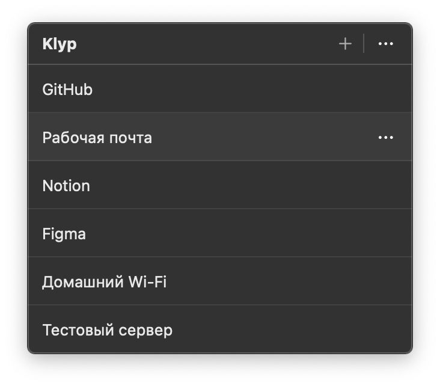

# Klyp

Klyp — небольшое приложение для macOS, которое хранит пароли в Keychain и копирует их из строки меню одним нажатием.

  

- Все данные остаются на локальном компьютере.
- Облака, синхронизации и сетевых функций нет.
- Скопированный пароль автоматически удаляется из буфера через 30 секунд, если содержимое буфера не изменилось.
- Поддерживаются Mac с Apple Silicon и Intel под управлением macOS 13 или новее.

## Сборка из исходников

Требуется Xcode 15.4 или новее.

1. Откройте `Klyp.xcodeproj`.
2. В **Signing & Capabilities** выберите свою команду разработки.
3. Выберите схему `Klyp` и выполните **Product → Build**.

Сторонние библиотеки не требуются.

## Установка

1. Переместите `Klyp.app` в папку **Программы** (`/Applications`).
2. Запустите Klyp. Иконка ключа появится в строке меню; в Dock приложение не отображается.

Если macOS не позволяет открыть приложение обычным способом, нажмите на `Klyp.app` правой кнопкой мыши и выберите **Открыть**.

## Важно

После копирования пароль временно доступен другим локальным приложениям через системный буфер обмена. Менеджеры истории буфера могут сохранить его до автоматической очистки.

Удаление `Klyp.app` не удаляет записи из Keychain. Чтобы стереть их, сначала выберите **Удалить все данные…** в меню приложения.
